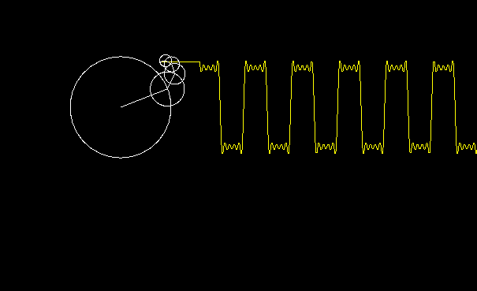
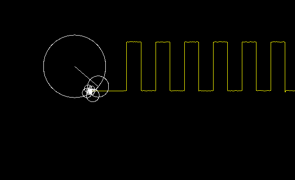

# Fourier Series 
a fourier series is a way to represent any periodic function in term of sin wavrs 
# Step Function
the step function is a fundemental part in computer science , it just oscillates between two values periodcally , its fourier series is :
```math f(x) = \frac{4}{\pi}\sum^{n}_{i=0}\frac{sin(nx)}{n} ```
as the value of n gets bigger and bigger the sum converges to the step function 
## Drawing the step function 
to draw the the step function (or any periodic function there is) we can use the fourier series to get a good enough approximation , then by represnting each sin wave by a line rotating at the frequency given we get the desired function 



this is the result using 4 sin waves
if we increse the number of waves to say 1000 we get a very good approximation 

# Try it out
download this repo and try inressing or decressing the precision to see the result
``` 
make
./output <precision>
```
having SFML installed is necessary
